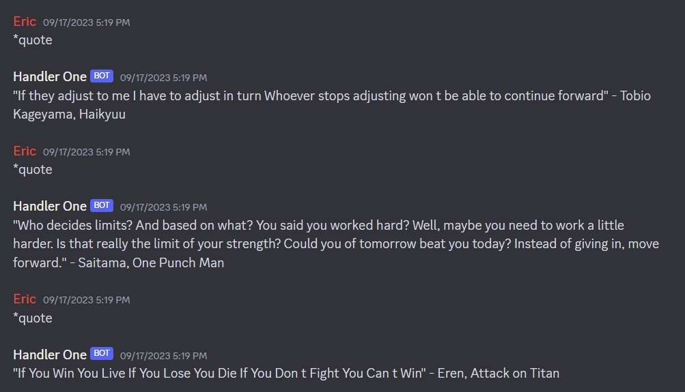

# Handler-One

Handler One is a discord bot utilized for entertainment.

## Contents
* [Features](#features)
* [Things Learned](#things-learned)
* [Preview](#preview)

## Features
* Playing music in a voice channel using ffmpeg, mp3 files, and txt files, sorted with the QuickSort algorithm
* Quiz Competitions using dictionaries, timers, and txt files
* Answering simple 'yes' or 'no' questions from keywords using Regex
* AI Chatting (implemented through https://github.com/3r1cZ/Chatbot)
* Displaying anime quotes using csv files
* Providing a random build in League of Legends or Valorant using txt files

## Things Learned
* Using Git and installing modules using 'pip install -r requirements.txt'
* Hiding variables, files, and folders with .gitignore and .env
* Creating virtual environments with venv
* Working with external files in Python
* Utilizing discord.py API

## Preview
### Contents
* [Help Function](#help-function)
* [Play Song Function](#play-song-function)
* [Quiz Function](#quiz-function)
* [AI Chatting Function](#ai-chatting-function)
* [Quote Function](#quote-function)
* [Random Bravery Function](#random-bravery-function)

#### Help Function

#### Play Song Function

#### Quiz Function

#### AI Chatting Function

#### Quote Function

#### Random Bravery Function

